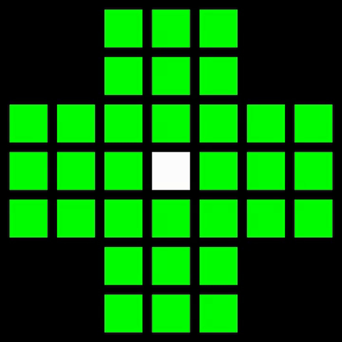

## Description
This is a little puzzle solver of a game my grandma has lying around from a household clearance.
There are a total of 32 pins aligned in a + shape with the center being free.
A pin can jump to a free cell, 2 spaces away (horizontally and diagonally), if there also is a neighbouring pin in that direction.
The jumped over pin gets removed.
The goal is to remove as many pins as possible, with the perfect score being just one pin left.

Neither me nor my grandma were able to achieve this perfect score, hence I wrote this little algorithm to find out if it was possible.

## Solution
